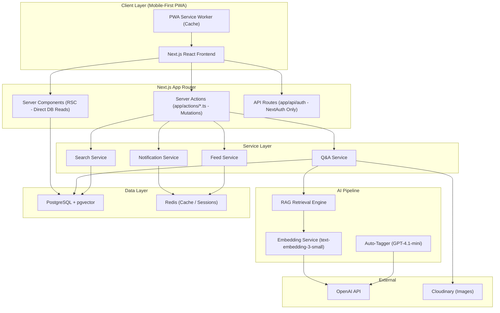
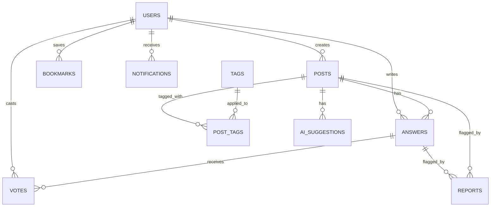
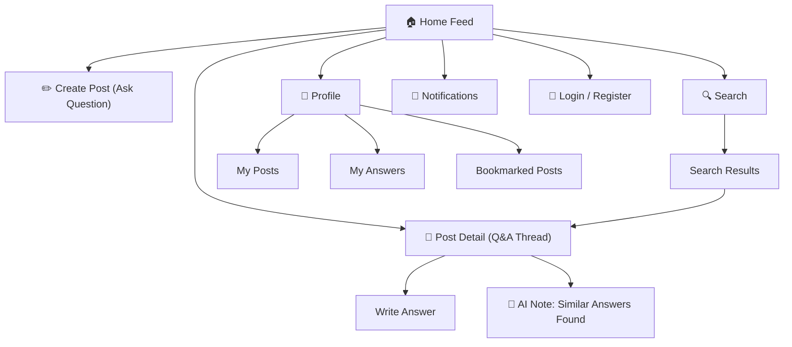
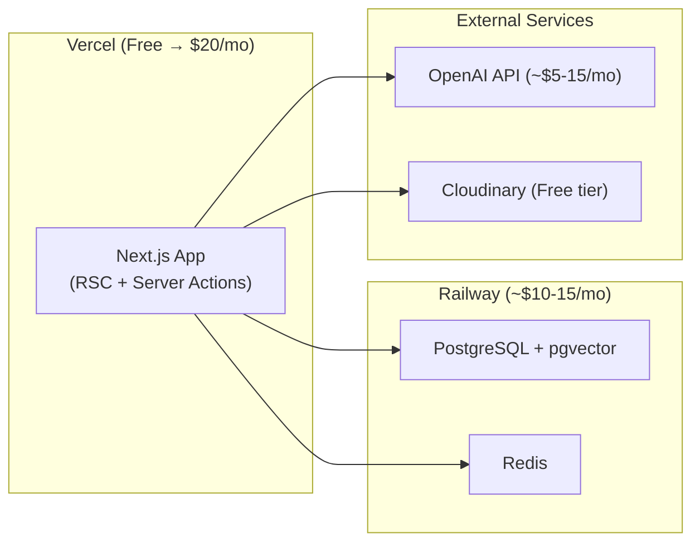

# PAANO PUMUNTA: Full System Architecture (v2)

> A Community Guide for Commuters — Community is truth, AI is the librarian.

---

## 1. Platform Overview

**PAANO PUMUNTA** is a community-powered Q&A platform where Filipino commuters ask and answer "Paano pumunta sa ___ galing sa ___?" questions. The platform structures, preserves, and makes searchable the commuting knowledge that currently lives scattered across Facebook groups.

### Core Philosophy
- **Community is the source of truth** — every route traces back to a real human who traveled it
- **AI retrieves, never generates** — AI surfaces existing verified answers, it does not invent routes
- **Filipino-first UX** — landmark-based navigation, Taglish support, mobile-first design
- **The feed is the heart** — everything revolves around the community Q&A feed

---

## 2. System Architecture

### Why Next.js? (Full-Stack with Server Components & Server Actions)

Next.js covers **both frontend and backend**:

| Layer | What Next.js Provides |
|-------|----------------------|
| **Frontend** | React Server Components (RSC), pages, layouts, client components |
| **Backend (Reads)** | Direct Prisma database queries inside Server Components (Zero API boilerplate for data fetching) |
| **Backend (Mutations)** | Next.js Server Actions (`app/actions/*.ts`) — handles forms, votes, posts, answers, bookmarks |
| **Auth API Route** | API Routes reserved exclusively for NextAuth (`app/api/auth/[...nextauth]/route.ts`) |
| **Deployment** | Single deploy to Vercel — frontend, server components, and actions deploy together |

No need for a separate REST API layer. Everything lives in one full-stack TypeScript codebase:

```
komyut/
├── app/
│   ├── actions/                  ← Server Actions (Backend Mutations)
│   │   ├── auth-actions.ts       ← Auth actions (login, register, logout)
│   │   ├── post-actions.ts       ← Create, update, delete posts
│   │   ├── answer-actions.ts     ← Create, edit, delete, accept answers
│   │   ├── vote-actions.ts       ← Upvote / downvote actions
│   │   ├── bookmark-actions.ts   ← Toggle bookmark action
│   │   ├── ai-actions.ts         ← Auto-tagging & AI similarity retrieval
│   │   ├── notification-actions.ts ← Mark notifications as read
│   │   └── report-actions.ts     ← Content moderation actions
│   ├── api/                      ← Reserved ONLY for NextAuth
│   │   └── auth/
│   │       ├── [...nextauth]/
│   │       │   └── route.ts      ← NextAuth route handler
│   │       └── register/         ← Optional register API fallback
│   ├── feed/
│   │   └── page.tsx              ← Feed page (Server Component)
│   ├── post/
│   │   ├── create/
│   │   │   └── page.tsx          ← Create post page
│   │   └── [id]/
│   │       └── page.tsx          ← Post detail Q&A thread (Server Component)
│   ├── search/
│   │   └── page.tsx              ← Hybrid search page
│   ├── profile/
│   │   └── page.tsx              ← User profile page
│   ├── user/
│   │   └── [id]/
│   │       └── page.tsx          ← Public user profile page
│   ├── login/
│   │   └── page.tsx              ← Login page
│   ├── register/
│   │   └── page.tsx              ← Register page
│   ├── layout.tsx                ← Root layout
│   └── page.tsx                  ← Landing page / Home feed redirect
├── components/                   ← React UI components (Client + Server)
│   ├── feed/                     ← Feed components (post-card, create-post-box, post-list)
│   ├── landing/                  ← Landing page components
│   ├── layout/                   ← Navbar, Left/Right sidebars, Mobile bottom nav
│   ├── post/                     ← Answer card, Answer input, AI suggestion card
│   ├── providers/                ← Auth & Context providers
│   ├── shared/                   ← Status badges, transport badges, vote buttons
│   ├── sidebar/                  ← Community stats, top contributors, trending routes
│   └── ui/                       ← Shadcn UI primitives (button, card, avatar, skeleton, etc.)
├── hooks/                        ← Custom React hooks (use-feed-filter, use-mobile-detect)
├── lib/                          ← Core server & client utilities
│   ├── prisma.ts                 ← Prisma client singleton
│   ├── auth.ts                   ← NextAuth options & helpers
│   ├── embeddings.ts             ← OpenAI embeddings & pgvector search
│   ├── formatters.ts             ← Date, time & text formatters
│   ├── constants.ts              ← App constants
│   └── utils.ts                  ← Shadcn cn() helper & general utilities
├── prisma/
│   ├── schema.prisma             ← Full database schema
│   └── seed.ts                   ← Seeding script
├── types/                        ← TypeScript type definitions
│   ├── index.ts
│   └── next-auth.d.ts
└── public/                       # Static public assets
```

### High-Level Architecture



### Tech Stack

| Layer | Technology | Rationale |
|-------|-----------|-----------|
| **Full-Stack Framework** | Next.js 15+ (App Router) | Server Components for instant reads + Server Actions for mutations |
| **Language** | TypeScript | Strict type safety across UI, DB, and Server Actions |
| **Styling** | Tailwind CSS + Shadcn UI | Utility-first styling with accessible primitive components |
| **Icons** | Lucide React (`lucide-react`) | Clean, modern UI icon set |
| **Database** | PostgreSQL + pgvector extension | Relational + vector search in one DB |
| **ORM** | Prisma ORM | Type-safe database client and migrations |
| **Cache** | Redis | Session storage & feed caching |
| **Auth** | NextAuth.js (Auth.js) | Google/Facebook OAuth + Credentials auth |
| **AI (Embeddings)** | OpenAI `text-embedding-3-small` | Cost-effective vector embeddings, strong multilingual support |
| **AI (LLM)** | OpenAI `GPT-4.1-mini` | Tag extraction, summarization (never route generation) |
| **File Storage** | Cloudinary / S3 | Image uploads (landmark photos, terminal photos) |
| **Deployment** | Vercel (App) + Railway (DB + Redis) | Single deploy, affordable, scalable |

---

## 3. Data Model

### Entity Relationship Diagram



### MVP Database Schema (10 Core Tables)

---

#### `users`
| Column | Type | Description |
|--------|------|-------------|
| `id` | UUID (PK) | Unique identifier |
| `email` | VARCHAR(255) UNIQUE | Email address |
| `username` | VARCHAR(50) UNIQUE | Display name |
| `avatar_url` | TEXT | Profile photo URL |
| `auth_provider` | ENUM | `google`, `facebook`, `email` |
| `auth_provider_id` | VARCHAR(255) | OAuth provider ID |
| `bio` | TEXT | Short user bio (nullable) |
| `home_area` | VARCHAR(100) | User's primary area, e.g., "Quezon City" (nullable) |
| `is_banned` | BOOLEAN | Moderation flag (default: false) |
| `created_at` | TIMESTAMP | Account creation date |
| `last_active_at` | TIMESTAMP | Last activity |

---

#### `posts` (Questions)
| Column | Type | Description |
|--------|------|-------------|
| `id` | UUID (PK) | Unique identifier |
| `user_id` | UUID (FK → users) | Who posted the question |
| `title` | VARCHAR(200) | Short title (e.g., "Paano pumunta sa BGC galing Fairview?") |
| `body` | TEXT | Additional context (nullable) |
| `origin_text` | VARCHAR(200) | "From" text as typed by user |
| `destination_text` | VARCHAR(200) | "To" text as typed by user |
| `is_anonymous` | BOOLEAN | Post displayed anonymously (default: false) |
| `view_count` | INTEGER | Number of views (default: 0) |
| `answer_count` | INTEGER | Denormalized answer count (default: 0) |
| `image_urls` | TEXT[] | Optional attached photos |
| `created_at` | TIMESTAMP | Post creation time |
| `updated_at` | TIMESTAMP | Last update time |

> [!NOTE]
> No `status` field — posts are always open. The community is always alive; someone might have a newer or better route anytime.

---

#### `answers`
| Column | Type | Description |
|--------|------|-------------|
| `id` | UUID (PK) | Unique identifier |
| `post_id` | UUID (FK → posts) | Which question this answers |
| `user_id` | UUID (FK → users) | Who wrote the answer |
| `body` | TEXT | Full answer text (the directions/instructions) |
| `upvote_count` | INTEGER | Denormalized upvote count (default: 0) |
| `downvote_count` | INTEGER | Denormalized downvote count (default: 0) |
| `is_accepted` | BOOLEAN | Marked as best answer by poster (default: false) |
| `image_urls` | TEXT[] | Photos (terminal, landmark, signboard) |
| `is_anonymous` | BOOLEAN | Answer displayed anonymously (default: false) |
| `created_at` | TIMESTAMP | Answer creation time |
| `updated_at` | TIMESTAMP | Last update time |

---

#### `votes`
| Column | Type | Description |
|--------|------|-------------|
| `id` | UUID (PK) | Unique identifier |
| `user_id` | UUID (FK → users) | Who voted |
| `answer_id` | UUID (FK → answers) | Which answer |
| `vote_type` | ENUM | `upvote`, `downvote` |
| `created_at` | TIMESTAMP | Vote time |

> **Unique constraint**: (`user_id`, `answer_id`) — one vote per user per answer

---

#### `bookmarks`
| Column | Type | Description |
|--------|------|-------------|
| `id` | UUID (PK) | Unique identifier |
| `user_id` | UUID (FK → users) | Who bookmarked |
| `post_id` | UUID (FK → posts) | Which post |
| `created_at` | TIMESTAMP | Bookmark time |

> **Unique constraint**: (`user_id`, `post_id`)

---

#### `tags`
| Column | Type | Description |
|--------|------|-------------|
| `id` | UUID (PK) | Unique identifier |
| `name` | VARCHAR(50) UNIQUE | Tag name (e.g., "QC", "MRT", "Makati") |
| `type` | ENUM | `area`, `transport`, `custom` |
| `usage_count` | INTEGER | How many posts use this tag (default: 0) |

---

#### `post_tags`
| Column | Type | Description |
|--------|------|-------------|
| `post_id` | UUID (FK → posts) | Post |
| `tag_id` | UUID (FK → tags) | Tag |

> **Primary key**: (`post_id`, `tag_id`)

---

#### `notifications`
| Column | Type | Description |
|--------|------|-------------|
| `id` | UUID (PK) | Unique identifier |
| `user_id` | UUID (FK → users) | Recipient |
| `type` | ENUM | `new_answer`, `upvote`, `accepted`, `mention` |
| `title` | VARCHAR(200) | Notification title |
| `body` | TEXT | Notification content |
| `reference_type` | ENUM | `post`, `answer` |
| `reference_id` | UUID | ID of the referenced entity |
| `is_read` | BOOLEAN | Read status (default: false) |
| `created_at` | TIMESTAMP | Creation time |

---

#### `ai_suggestions` (AI-surfaced related answers — shown in thread)
| Column | Type | Description |
|--------|------|-------------|
| `id` | UUID (PK) | Unique identifier |
| `post_id` | UUID (FK → posts) | The question this suggestion appears on |
| `matched_post_id` | UUID (FK → posts) | The similar existing question found |
| `matched_answer_id` | UUID (FK → answers) | The relevant existing answer |
| `similarity_score` | FLOAT | Cosine similarity score (0-1) |
| `was_helpful` | BOOLEAN | Did users find this helpful? (nullable) |
| `created_at` | TIMESTAMP | Creation time |

---

#### `reports` (Moderation)
| Column | Type | Description |
|--------|------|-------------|
| `id` | UUID (PK) | Unique identifier |
| `reporter_id` | UUID (FK → users) | Who reported |
| `target_type` | ENUM | `post`, `answer` |
| `target_id` | UUID | ID of reported entity |
| `reason` | ENUM | `wrong_info`, `spam`, `offensive`, `other` |
| `description` | TEXT | Additional details (nullable) |
| `status` | ENUM | `pending`, `reviewed`, `resolved`, `dismissed` |
| `created_at` | TIMESTAMP | Report time |

---

### Embeddings (Stored in pgvector)

These are **not separate tables** in the traditional sense — they're columns using pgvector's `VECTOR` type added to the existing tables via a dedicated embeddings table:

#### `embeddings`
| Column | Type | Description |
|--------|------|-------------|
| `id` | UUID (PK) | Unique identifier |
| `source_type` | ENUM | `post`, `answer` |
| `source_id` | UUID | Post or Answer ID |
| `embedding` | VECTOR(1536) | Embedding vector from text-embedding-3-small |
| `text_content` | TEXT | The original text that was embedded |
| `created_at` | TIMESTAMP | Creation time |

---

### Transport Modes (Seed Data)

| Name | Icon | Color | Notes |
|------|------|-------|-------|
| Jeepney | 🚐 | `#F59E0B` | The backbone of PH transit |
| Bus | 🚌 | `#3B82F6` | City and provincial buses |
| MRT | 🚇 | `#8B5CF6` | MRT-3 (EDSA line) |
| LRT-1 | 🚇 | `#10B981` | Baclaran to Roosevelt |
| LRT-2 | 🚇 | `#06B6D4` | Recto to Antipolo |
| Tricycle | 🛺 | `#EF4444` | Local/barangay transport |
| Walk | 🚶 | `#6B7280` | Walking segments |

> [!NOTE]
> Transport modes are used as **tags** on posts in MVP (not structured route steps). Users mention them in their text answers naturally.

---

## 4. Platform Structure & Pages

### Page Map (MVP)



### Page Layouts

---

#### 1. 🏠 Home Feed (Heart of the Platform)

The main feed showing recent commute questions from the community.

```
┌─────────────────────────────────────────────────┐
│  🚌 PAANO PUMUNTA                    🔔  👤    │
├─────────────────────────────────────────────────┤
│  ┌─────────────────────────────────────────┐    │
│  │ 📍 From: ________  📍 To: ________     │    │
│  │           [ Itanong sa Community ]       │    │
│  └─────────────────────────────────────────┘    │
│                                                  │
│  [ 🆕 Latest ] [ 🔥 Most Answered ] [ 🔍 ]    │
│                                                  │
│  ┌─────────────────────────────────────────┐    │
│  │ 👤 Maria • 5 mins ago                   │    │
│  │ Paano pumunta sa UP Diliman galing      │    │
│  │ Cubao MRT Station?                       │    │
│  │                                          │    │
│  │ 🏷️ #QC #MRT #Jeepney                   │    │
│  │ 💬 3 answers  👁️ 45                    │    │
│  └─────────────────────────────────────────┘    │
│                                                  │
│  ┌─────────────────────────────────────────┐    │
│  │ 🙈 Anonymous • 12 mins ago              │    │
│  │ Pano mag commute papuntang Intramuros   │    │
│  │ from SM North EDSA?                      │    │
│  │                                          │    │
│  │ 🏷️ #Manila #QC #Bus                    │    │
│  │ 💬 1 answer  👁️ 23                     │    │
│  └─────────────────────────────────────────┘    │
│                                                  │
│  [ Load More... ]                                │
│                                                  │
├─────────────────────────────────────────────────┤
│  🏠 Home    🔍 Search    ✏️ Ask    👤 Profile  │
└─────────────────────────────────────────────────┘
```

---

#### 2. 📝 Post Detail Page (Q&A Thread)

Full question with all community answers. **AI suggestions appear here inside the thread** — visible to the poster and all viewers.

```
┌─────────────────────────────────────────────────┐
│  ← Back                               🔖 Save  │
├─────────────────────────────────────────────────┤
│                                                  │
│  Paano pumunta sa UP Diliman galing              │
│  Cubao MRT Station?                              │
│                                                  │
│  👤 Maria • 5 mins ago                          │
│  📍 From: Cubao MRT Station                     │
│  📍 To: UP Diliman                              │
│  🏷️ #QC #MRT #Jeepney                          │
│                                                  │
│  "First time ko pumunta sa UP, di ko alam       │
│   saan sasakay ng jeep. Help po!"                │
│                                                  │
│  ── 3 Answers ─────────────────────────────      │
│                                                  │
│  ┌─────────────────────────────────────────┐     │
│  │ ✅ Best Answer                          │     │
│  │ 👤 Juan • 3 mins ago                   │     │
│  │                                          │     │
│  │ Pag baba mo sa Cubao MRT, lakad ka      │     │
│  │ papunta sa Aurora Blvd (tapat ng         │     │
│  │ Gateway). Dun may sakayan ng jeep na     │     │
│  │ may sign na "PHILCOA". Sabihin mo sa     │     │
│  │ driver ibaba ka sa UP Main Gate (yung    │     │
│  │ may malaking arch).                      │     │
│  │                                          │     │
│  │ 👍 45   👎 2                            │     │
│  └─────────────────────────────────────────┘     │
│                                                  │
│  ┌ ─ ─ ─ ─ ─ ─ ─ ─ ─ ─ ─ ─ ─ ─ ─ ─ ─ ─ ┐    │
│  │ 🤖 AI Note                              │    │
│  │ May similar na sinagot na ang community: │    │
│  │                                          │    │
│  │ 📌 "Cubao to UP Campus via jeep"        │    │
│  │    — answered by @Pedro (👍 32)          │    │
│  │ 📌 "Gateway to UP Diliman commute"      │    │
│  │    — answered by @Ana (👍 28)            │    │
│  │                                          │    │
│  │ [View these answers →]                   │    │
│  │ Was this helpful?  👍  👎               │    │
│  └ ─ ─ ─ ─ ─ ─ ─ ─ ─ ─ ─ ─ ─ ─ ─ ─ ─ ─ ┘    │
│                                                  │
│  ┌─────────────────────────────────────────┐     │
│  │ 👤 Ana • 2 mins ago                    │     │
│  │                                          │     │
│  │ Alternative: Pag weekend, pwede ka rin   │     │
│  │ sumakay ng Ikot jeep sa loob ng UP       │     │
│  │ campus pag nasa gate ka na. Free yun!    │     │
│  │                                          │     │
│  │ 👍 18   👎 0                            │     │
│  └─────────────────────────────────────────┘     │
│                                                  │
│  ┌─────────────────────────────────────────┐     │
│  │ ✏️ Write your answer...                 │     │
│  │                                          │     │
│  │ [ 📷 Add Photo ]  [ 🙈 Anonymous ]      │     │
│  │                          [ Submit →]     │     │
│  └─────────────────────────────────────────┘     │
│                                                  │
└─────────────────────────────────────────────────┘
```

> [!IMPORTANT]
> **AI Suggestion Flow**: The AI suggestion card appears **inside the thread** after the post is created. It's triggered by the post's content (origin + destination + body text) being matched against existing answered posts. Both the poster and all viewers can see it. It's labeled as a note, not an authoritative answer. Users can rate if it was helpful, which improves future suggestions.

---

#### 3. ✏️ Create Post (Ask a Question)

Simple, fast question composer. The focus is **"From" and "To"** — that's all you really need.

```
┌─────────────────────────────────────────────────┐
│  ← Cancel              Itanong sa Community      │
├─────────────────────────────────────────────────┤
│                                                  │
│  📍 From (Saan ka manggagaling?):               │
│  ┌─────────────────────────────────────────┐    │
│  │ e.g., Cubao MRT Station                 │    │
│  └─────────────────────────────────────────┘    │
│                                                  │
│  📍 To (Saan ka pupunta?):                      │
│  ┌─────────────────────────────────────────┐    │
│  │ e.g., UP Diliman                         │    │
│  └─────────────────────────────────────────┘    │
│                                                  │
│  Title (auto-generated, editable):               │
│  ┌─────────────────────────────────────────┐    │
│  │ Paano pumunta sa UP Diliman galing      │    │
│  │ Cubao MRT Station?                       │    │
│  └─────────────────────────────────────────┘    │
│                                                  │
│  Additional details (optional):                  │
│  ┌─────────────────────────────────────────┐    │
│  │ First time ko pumunta, di ko alam       │    │
│  │ saan sasakay...                          │    │
│  └─────────────────────────────────────────┘    │
│                                                  │
│  [ 📷 Add Photo ]                                │
│                                                  │
│  ☐ Post as Anonymous                             │
│                                                  │
│  ┌─────────────────────────────────────────┐    │
│  │          [ I-post na! →]                 │    │
│  └─────────────────────────────────────────┘    │
│                                                  │
└─────────────────────────────────────────────────┘
```

**Auto-generated title**: When user fills in From/To, the title auto-generates as *"Paano pumunta sa [To] galing [From]?"* — editable if they want to customize.

---

#### 4. 🔍 Search Page

Search across all posts and answers.

```
┌─────────────────────────────────────────────────┐
│  🔍 Search                                      │
├─────────────────────────────────────────────────┤
│                                                  │
│  ┌─────────────────────────────────────────┐    │
│  │ 🔍 Search routes, places, questions...  │    │
│  └─────────────────────────────────────────┘    │
│                                                  │
│  Filter: [ All ] [ 🏷️ By Area ] [ 🚐 Mode ]  │
│  Sort:   [ Relevant ] [ Latest ] [ Most Voted ] │
│                                                  │
│  ── Results ───────────────────────────────      │
│                                                  │
│  ┌─────────────────────────────────────────┐    │
│  │ Paano pumunta sa BGC galing Fairview?   │    │
│  │ 💬 5 answers  👍 Top: 34 upvotes       │    │
│  │ 🏷️ #Fairview #BGC #Bus #MRT            │    │
│  └─────────────────────────────────────────┘    │
│  ┌─────────────────────────────────────────┐    │
│  │ SM Fairview to Bonifacio Global City    │    │
│  │ 💬 3 answers  👍 Top: 21 upvotes       │    │
│  │ 🏷️ #Fairview #BGC #MRT                 │    │
│  └─────────────────────────────────────────┘    │
│                                                  │
└─────────────────────────────────────────────────┘
```

**Search is hybrid:**
- Keyword search (PostgreSQL full-text search) — matches exact terms
- Semantic search (pgvector) — finds "Cubao to UP" even if they searched "Gateway to Diliman"
- Results ranked by: relevance × upvotes × freshness

---

#### 5. 👤 Profile Page

```
┌─────────────────────────────────────────────────┐
│  ← Back                            ⚙️ Settings │
├─────────────────────────────────────────────────┤
│                                                  │
│         [Avatar]                                 │
│         @juan_commuter                           │
│         "Taga-QC, alam ko lahat ng jeep dito"   │
│         📍 Quezon City                          │
│         📅 Joined July 2026                     │
│                                                  │
│  ┌──────────┬──────────┬──────────┐             │
│  │ 12 Posts │ 45 Ans.  │ 8 Saved  │             │
│  └──────────┴──────────┴──────────┘             │
│                                                  │
│  [ My Posts ] [ My Answers ] [ Bookmarks ]       │
│                                                  │
│  ── My Posts ──────────────────────────────      │
│  ┌─────────────────────────────────────────┐    │
│  │ Paano pumunta sa Antipolo galing QC?    │    │
│  │ 💬 3 answers  •  5 days ago             │    │
│  └─────────────────────────────────────────┘    │
│                                                  │
└─────────────────────────────────────────────────┘
```

---

## 5. Community Features (MVP)

### Anonymous Posting ✅
- **Account is required** (non-negotiable — needed for moderation and notifications)
- Users can **toggle "Post as Anonymous"** when creating a post or answer
- Anonymous posts show "🙈 Anonymous" instead of username
- The system still knows who posted (for moderation), but other users don't see it
- Mirrors FB groups behavior — lowers barrier for "basic" questions

### Voting System
- **Upvote / Downvote** on answers
- One vote per user per answer (can change vote)
- Most upvoted answers float to the top
- **Accept Best Answer** — question poster can mark one answer as the best

### Bookmarks
- Save posts for later reference
- "Naka-save ko na yung route, di ko na kailangan itanong ulit"
- Accessible from profile page

### Reporting
- Report wrong info, spam, or offensive content
- Simple flow: select reason → optional description → submit
- Admin reviews reports

### Notifications (MVP scope)
- "Someone answered your question"
- "Your answer was accepted as best"
- "Your answer was upvoted"

---

## 6. AI Pipeline Architecture

### AI Model Roles

| Model | Role | What It Does |
|-------|------|-------------|
| `text-embedding-3-small` | **Embeddings** | Converts post/answer text into vectors for similarity search. 1536 dimensions. ~$0.02 per 1M tokens. |
| `GPT-4.1-mini` | **LLM Tasks** | Auto-tagging posts, summarizing community consensus (attributed). Never generates route directions. |

> [!IMPORTANT]
> **GPT-4.1-mini** is an excellent choice for this pipeline. It's fast, cheap ($0.40/1M input tokens), and capable enough for tag extraction and summarization. For embeddings, `text-embedding-3-small` is the right model — it's purpose-built for vector search and handles Filipino/English code-switching well.

### AI Suggestion Flow (Updated)

```mermaid
flowchart TD
    A["User creates a new post"] --> B["Post is published to feed"]
    B --> C["System generates embedding from post text\n(origin + destination + body)"]
    C --> D["Vector similarity search against\nexisting post embeddings"]
    D --> E{"Similar posts found?\n(similarity > 0.80)"}
    E -->|Yes| F["Fetch the top-voted answers\nfrom those similar posts"]
    F --> G["Create AI Suggestion record"]
    G --> H["Display as '🤖 AI Note' card\ninside the post thread"]
    H --> I["Visible to poster AND\nall other viewers"]
    I --> J["Users can rate:\n'Was this helpful? 👍 👎'"]
    J --> K["Feedback improves\nfuture similarity threshold"]
    E -->|No| L["No AI suggestion shown\nPost waits for community answers"]
    
    M["Community member writes an answer"] --> N["Generate embedding for the answer"]
    N --> O["Store in pgvector for\nfuture similarity matching"]
    
    style H fill:#1e293b,stroke:#3b82f6,stroke-width:2px
    style L fill:#1e293b,stroke:#6b7280
```



### Key Pipeline Details

#### 1. Embedding Ingestion (On Content Creation)
- **When a post is created**: Embed `origin_text + destination_text + title + body` → store vector
- **When an answer is created**: Embed `body` → store vector
- **Async**: Embedding generation happens in the background, doesn't block the user

#### 2. AI Suggestion (After Post Creation)
- **Triggered**: Immediately after a new post is published
- **Process**: Search pgvector for existing posts with similar origin-destination pairs
- **Display**: "🤖 AI Note" card inside the thread — **not** before posting
- **Attribution**: Always shows the original post title and answerer username
- **Non-blocking**: Users can ignore it and wait for fresh community answers
- **Feedback loop**: 👍/👎 on AI suggestions tunes future relevance

#### 3. Smart Search (On User Search)
- **Hybrid**: PostgreSQL full-text search + pgvector semantic similarity
- **Ranking formula**: `score = (0.4 × keyword_match) + (0.3 × semantic_similarity) + (0.2 × upvote_score) + (0.1 × freshness)`
- **Taglish handling**: Embeddings naturally handle code-switching (Filipino + English mixed)
- **Synonym awareness**: "QC" matches "Quezon City", "UPD" matches "UP Diliman" (via semantic similarity)

#### 4. Auto-Tagging (On Post Creation)
- **How**: GPT-4.1-mini extracts likely area tags and transport mode tags from the post text
- **Example**: "Pano pumunta ng megamall galing sm fairview thru mrt?" → suggests `#Fairview`, `#Megamall`, `#MRT`, `#Mandaluyong`
- **User control**: Tags are auto-suggested, user can accept/edit/remove before posting

### What AI Does NOT Do

| ❌ Forbidden | Why |
|---|---|
| Generate route directions | Hallucination risk = real-world safety issue |
| Act as the authoritative answer | Community is the source of truth |
| Combine partial routes into new ones | Unverified combinations could be wrong |
| Answer questions in place of community | AI supplements, never replaces |

---

## 7. Architecture & Action Design

Instead of traditional REST API endpoints, KOMYUT uses **Server Components (RSC)** for page rendering/reads, **Server Actions (`app/actions/*.ts`)** for data mutations, and `/api` reserved exclusively for NextAuth.

### Auth
| Handler / Action | Path / Function | Type | Description |
|------------------|-----------------|------|-------------|
| NextAuth Handler | `app/api/auth/[...nextauth]/route.ts` | API Route | OAuth & Credentials authentication routes |
| Register Action | `registerAction()` in `app/actions/auth-actions.ts` | Server Action | Register new user |
| Login Action | `loginAction()` in `app/actions/auth-actions.ts` | Server Action | Authenticate user credentials |

### Posts
| Action / Server Component | Path / Function | Type | Description |
|---------------------------|-----------------|------|-------------|
| Feed Page | `app/feed/page.tsx` | Server Component | Direct Prisma read for feed posts |
| Post Detail Page | `app/post/[id]/page.tsx` | Server Component | Direct Prisma read for post thread & answers |
| Create Post Action | `createPostAction()` in `app/actions/post-actions.ts` | Server Action | Submit new question |
| Update Post Action | `updatePostAction()` in `app/actions/post-actions.ts` | Server Action | Edit post |
| Delete Post Action | `deletePostAction()` in `app/actions/post-actions.ts` | Server Action | Delete post |
| Toggle Bookmark Action | `toggleBookmarkAction()` in `app/actions/bookmark-actions.ts` | Server Action | Bookmark/unbookmark post |

### Answers & Votes
| Action / Server Component | Path / Function | Type | Description |
|---------------------------|-----------------|------|-------------|
| Create Answer Action | `createAnswerAction()` in `app/actions/answer-actions.ts` | Server Action | Submit answer to a post |
| Edit Answer Action | `editAnswerAction()` in `app/actions/answer-actions.ts` | Server Action | Edit answer |
| Delete Answer Action | `deleteAnswerAction()` in `app/actions/answer-actions.ts` | Server Action | Delete answer |
| Accept Answer Action | `acceptAnswerAction()` in `app/actions/answer-actions.ts` | Server Action | Mark as best answer |
| Vote Action | `voteAction()` in `app/actions/vote-actions.ts` | Server Action | Upvote or downvote answer |

### Search & AI Actions
| Action / Server Component | Path / Function | Type | Description |
|---------------------------|-----------------|------|-------------|
| Search Page | `app/search/page.tsx` | Server Component | Hybrid search render |
| Auto-Tag Action | `suggestTagsAction()` in `app/actions/ai-actions.ts` | Server Action | GPT-4.1-mini tag extraction |
| Rate AI Suggestion | `rateAiSuggestionAction()` in `app/actions/ai-actions.ts` | Server Action | Feedback on AI notes |

---

## 8. Anonymous Posting Design

| Aspect | Implementation |
|--------|---------------|
| **Storage** | `user_id` is always stored in the DB (never null) |
| **Display** | If `is_anonymous = true`, show "🙈 Anonymous" as author |
| **Notifications** | Anonymous posters still receive "Someone answered your question" |
| **Moderation** | Admins can see the real user behind anonymous posts |
| **Answers** | Users can also answer anonymously (separate `is_anonymous` flag) |
| **Voting** | Anonymous posts can still be upvoted/downvoted |
| **Profile** | Anonymous posts do NOT appear on the user's public profile |

---

## 9. Data Seeding Strategy

Since we're launching for **all cities/areas** with manual seeding:

### Approach
1. **Source**: Collect Q&A data from Filipino FB commuter groups (manually)
2. **Format**: Structure each entry as a post + answer(s)
3. **Seed script**: A database seed script that bulk-inserts formatted data
4. **Embeddings**: Run embedding generation on all seeded content to populate pgvector
5. **Tags**: Auto-tag all seeded posts using GPT-4.1-mini

### Seed Data Format (JSON)
```json
{
  "posts": [
    {
      "origin": "SM Fairview",
      "destination": "Megamall",
      "title": "Paano pumunta sa Megamall galing SM Fairview?",
      "body": null,
      "answers": [
        {
          "body": "Sakay ka ng jeep or bus papuntang MRT North Ave. Tapos sumakay ka ng MRT, baba sa MRT Ortigas. Lakad papuntang Megamall, malapit lang sa station.",
          "upvotes": 0
        }
      ],
      "tags": ["Fairview", "Megamall", "MRT", "Jeepney"]
    }
  ]
}
```

---

## 10. Security & Privacy

| Area | Implementation |
|------|---------------|
| **Auth** | NextAuth.js — Google & Facebook OAuth + email/password. JWT with refresh tokens. |
| **Anonymous privacy** | Real identity stored server-side, hidden from UI. Only admins see it. |
| **Input sanitization** | All user input sanitized to prevent XSS. Prisma prevents SQL injection. |
| **Rate limiting** | Posts: 5/hour per user. Answers: 20/hour. Votes: 60/hour. Search: 30/min. |
| **Image uploads** | Validated file type/size. Served via Cloudinary CDN. |
| **API security** | Server Actions authorization checks, CSRF protection via Next.js |
| **Data deletion** | Users can delete account + all their data. |

---

## 11. Deployment



### Estimated Monthly Costs

| Service | Tier | Est. Cost |
|---------|------|-----------|
| Vercel | Hobby → Pro | Free → $20/mo |
| Railway (PostgreSQL + pgvector) | Starter | ~$5-10/mo |
| Railway (Redis) | Starter | ~$5/mo |
| OpenAI API | Pay-as-you-go | ~$5-15/mo |
| Cloudinary | Free tier | Free (25GB) |
| Domain | .com or .ph | ~$10-15/year |
| **Total** | | **~$15-50/mo** |

---

## 12. Backlog (Future MVPs)

The following features are **not in MVP** but tracked for future phases:

### Community & Gamification
- [ ] Reputation points system (points per upvote, accepted answer, etc.)
- [ ] Badge levels (Bagong Pasahero → Master Navigator)
- [ ] "Nasubukan Ko Rin!" verification vote (separate from upvote)
- [ ] Verification expiry (routes older than 6 months prompt re-verification)
- [ ] Leaderboard — Top contributors by area
- [ ] Trending routes section

### Map & Location
- [ ] Interactive Map Explorer page (browse routes on a map)
- [ ] Location autocomplete with geocoding
- [ ] `locations` table (structured location data with coordinates)
- [ ] `route_steps` table (structured step-by-step breakdown of answers)
- [ ] Map visualization of individual routes
- [ ] Community-pinned landmarks
- [ ] `geometry` field for route segments

### Route Enhancements
- [ ] Fare calculator / fare breakdown per transport leg
- [ ] Estimated travel duration
- [ ] Peak hours & tips per route
- [ ] Route comparison (Route A vs Route B)
- [ ] Transport modes: FX/Van, P2P Bus, UV Express, Grab/Angkas

### Platform Growth
- [ ] "Pababa Po" GPS alerts (notify when approaching your stop)
- [ ] Offline mode (PWA cache of bookmarked routes)
- [ ] Multi-language support (Bisaya, Ilocano)
- [ ] Real-time route alerts (road closures, MRT breakdowns)
- [ ] Community summary (AI-generated consensus summary with citations)
- [ ] Answer with structured route steps (form-based answer input)
- [ ] Push notifications (PWA or native)
- [ ] Mentions (@username in answers)
- [ ] Reply to specific answers (threaded comments)
- [ ] Share post to Facebook / other socials
- [ ] Admin dashboard for content moderation
- [ ] Analytics dashboard (popular routes, active hours)

---

*This architecture is designed so MVP is **lean, buildable, and solves the core problem**. Everything else grows from the backlog as the community grows. Ready for phased MVP planning when you approve.*
